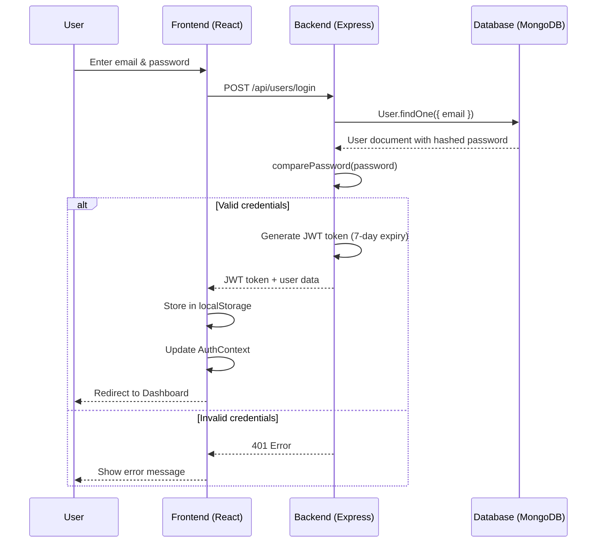
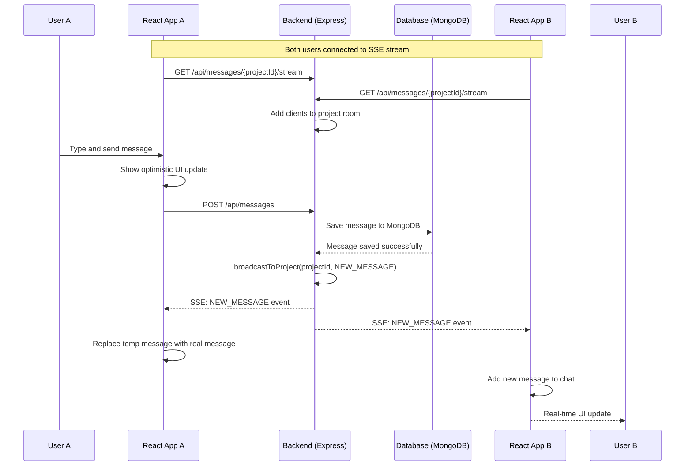

# 📘 Teamera — Black Book Project Report Prompts
> **Student:** Ashwinkumar Chavan | **PRN:** 04422000371 | **Class:** BCA 3rd Year | **University:** Tilak Maharashtra Vidyapeeth | **Guide:** Mr. Mayur Sir | **HOD:** Dr. Asmita Namjoshi Mam

---

## HOW TO USE THIS FILE
1. Copy each **"HUMAN PROMPT"** block and paste it into **ChatGPT / Gemini / Claude**.
2. For diagrams, use the tool mentioned beside each prompt.
3. Assemble output in **MS Word**, font **Times New Roman 12**, line spacing **1.5**, margins **1 inch all sides**, alignment **Justified**.

---

# PART 1 — REPORT CONTENT PROMPTS

---

## PROMPT 1 — Cover Page + Certificate + Acknowledgement

```
You are an academic technical writer for Indian universities.

Generate the following 3 pages for a BCA 3rd Year "Black Book" Project Report at Tilak Maharashtra Vidyapeeth. Use formal, academic English.

Student Details:
- Name: Ashwinkumar Chavan
- Class: BCA 3rd Year
- University: Tilak Maharashtra Vidyapeeth
- Project Guide: Mr. Mayur Sir (Faculty, Department of Computer Applications)

Project Details:
- Title: TEAMERA — A Collaborative Team & Project Management Web Application
- Application Area: Web Application / Team Collaboration Platform
- Tech Stack: React.js, Node.js, Express.js, MongoDB, Socket.io

Generate:

PAGE 1 — COVER / TITLE PAGE
Layout the text for a title page including:
- University name (top)
- Project title (center, large)
- "A Project Report submitted in partial fulfillment of the requirements for the Degree of Bachelor of Computer Applications"
- Student name, PRN: [STUDENT PRN], Class: BCA 3rd Year
- Academic Year: 2025–2026
- Department of Computer Applications, Tilak Maharashtra Vidyapeeth, Pune

PAGE 2 — CERTIFICATE
Draft a formal certificate signed by Project Guide (Mr. Mayur Sir), HOD, and External Examiner certifying that "Ashwinkumar Chavan" has satisfactorily completed the project "TEAMERA" in partial fulfillment of BCA 3rd Year.

PAGE 3 — ACKNOWLEDGEMENT
Write a heartfelt academic acknowledgement (250–300 words) thanking:
- Tilak Maharashtra Vidyapeeth
- HOD, Department of Computer Applications
- Project Guide Mr. Mayur Sir
- Friends and family
```

---

## PROMPT 2 — Synopsis + Table of Contents

```
You are an academic technical writer for Indian universities.

Write the following 2 sections for a BCA 3rd Year Black Book for the project "TEAMERA".

PROJECT: TEAMERA — A Collaborative Team & Project Management Web Application
Description: Teamera is a full-stack web application that allows students and developers to create projects, build teams, manage workspaces, communicate via real-time chat (Socket.io), post in a community feed, and track tasks. Built with React.js (frontend), Node.js + Express.js (backend), MongoDB (database), and deployed on Vercel.

Key Features:
- User Authentication (JWT-based Register/Login)
- Project Creation & Team Recruitment
- Real-time Workspace Chat (Socket.io)
- Task Management (Kanban-style)
- Community Posts & Interaction
- Team Invitation System (Invite members directly by email/username)
- Profile Management with Resume Upload
- Dashboard with Application Tracking

Student: Ashwinkumar Chavan | BCA 3rd Year | Tilak Maharashtra Vidyapeeth | Guide: Mr. Mayur Sir

Generate:

SECTION 1 — PROJECT SYNOPSIS (400–500 words)
Covering: Introduction, Problem Statement, Proposed System, Objectives, Scope.

SECTION 2 — INDEX / TABLE OF CONTENTS
Provide a detailed Table of Contents with chapter names, sub-topic names, and placeholder page numbers (e.g., 1, 5, 10...). Must cover minimum 80 pages. Include:
- Cover Page, Certificate, Acknowledgement, Synopsis
- List of Figures, List of Tables
- Chapter 1: Introduction
- Chapter 2: System Analysis
- Chapter 3: System Requirements & Tools
- Chapter 4: System Design (with all diagrams)
- Chapter 5: Implementation
- Chapter 6: UI/UX Design and Screenshots
- Chapter 7: Testing & Validation
- Future Scope & Limitations
- Conclusion & Developer's Comment
- References & Bibliography
```

---

## PROMPT 3 — Chapter 1: Introduction

```
You are an academic technical writer for Indian universities.

Write Chapter 1: Introduction for a BCA 3rd Year Black Book Project Report.

Project: TEAMERA — A Collaborative Team & Project Management Web Application
Student: Ashwinkumar Chavan | BCA 3rd Year | Tilak Maharashtra Vidyapeeth | Guide: Mr. Mayur Sir

Chapter 1 must include the following sub-sections (minimum 8–10 pages of content):

1.1 Introduction to the Project
1.2 Problem Statement
  - Existing System & its Drawbacks
  - Proposed System & its Advantages
1.3 Objectives of the Project
1.4 Scope of the Project
1.5 Motivation Behind the Project
1.6 Overview of Technologies Used
  - React.js, Node.js, Express.js, MongoDB, Socket.io, JWT, Vite
1.7 Application Area
1.8 Report Organization (brief description of each chapter)

Write in formal academic English. Paragraphs must be indented. Content should be detailed and thorough enough to fill 10 printed A4 pages.
```

---

## PROMPT 4 — Chapter 2: System Analysis + Chapter 3: Requirements

```
You are an academic technical writer for Indian universities.

Write Chapter 2 and Chapter 3 for a BCA 3rd Year Black Book for project "TEAMERA".

Project: TEAMERA — A Collaborative Team & Project Management Web Application
Stack: React.js, Node.js, Express.js, MongoDB, Socket.io, JWT, Vite

CHAPTER 2 — SYSTEM ANALYSIS (min 8 pages)
2.1 Feasibility Study
  - Economic Feasibility
  - Technical Feasibility
  - Operational Feasibility
  - Schedule Feasibility
2.2 Existing System Analysis
  - Study of similar platforms (GitHub, Slack, Trello, LinkedIn)
  - Limitations of existing systems
2.3 Proposed System
  - Features and advantages over existing systems
2.4 System Development Life Cycle (SDLC) — Agile Model

CHAPTER 3 — SYSTEM REQUIREMENTS & TOOLS (min 6 pages)
3.1 Hardware Requirements
  - Processor: Intel Core i5 or higher
  - RAM: 8 GB or higher
  - Storage: 256 GB SSD
  - Network: Broadband Internet Connection

3.2 Software Requirements
  - OS: Windows 10/11 (Development), Linux (Server)
  - Frontend: React.js 18, Vite 5, Lucide React Icons
  - Backend: Node.js, Express.js 4, Socket.io 4, Multer, Helmet, JWT, Bcrypt.js
  - Database: MongoDB 7 (NoSQL), Mongoose 9
  - Tools: VS Code, Git, GitHub, Postman, MongoDB Atlas, Vercel

3.3 Language Details
  - JavaScript (ES6+), HTML5, CSS3

3.4 Database Details
  - MongoDB: Collections — Users, Projects, Applications, Messages, Posts, Notifications

3.5 Tool & Library Overview (describe each tool/library briefly)

Write in formal academic language. Detailed and thorough.
```

---

## PROMPT 5 — Chapter 4: System Design (Text Description for Diagrams)

```
You are an academic technical writer for Indian universities.

Write Chapter 4: System Design for a BCA 3rd Year Black Book for project "TEAMERA" (A Collaborative Team & Project Management Web Application using React.js, Node.js, MongoDB, Socket.io).

Student: Ashwinkumar Chavan | BCA 3rd Year | Tilak Maharashtra Vidyapeeth | Guide: Mr. Mayur Sir

CHAPTER 4 — SYSTEM DESIGN (min 12 pages of textual description)

4.1 System Architecture
  - Three-Tier Architecture: Client (React), Server (Node/Express), Database (MongoDB)
  - Describe Figure 1: Three-Tier Architecture of TEAMERA
4.2 Data Flow Diagrams
  - Describe Figure 2: Level 0 DFD - Context Diagram
  - Describe Figure 3: Level 1 DFD - System Processes
  - Describe Figure 4: Level 2 DFD - Workspace Collaboration Module
4.3 Entity Relationship Diagram (ERD)
  - Describe Figure 5: Entity Relationship Diagram (ERD)
  - List all attributes and relationships
4.4 UML Diagrams
  - Describe Figure 6: UML Use Case Diagram
  - Describe Figure 7: Sequence Diagram: User Login Flow
  - Describe Figure 8: Sequence Diagram: Real-time Chat via Socket.io
  - Describe Figure 9: UML Class Diagram
4.5 Flowcharts
  - Describe Figure 10: Flowchart — User Registration & Login
  - Describe Figure 11: Flowchart — Project Creation & Application Flow
4.6 Database Schema Design
  - Detail each MongoDB Collection schema (Users, Projects, Applications, Dashboards, Messages, Posts, Notifications)

Write formal academic text describing what each diagram shows. These descriptions go alongside the actual diagram images in the report.
```

---

## PROMPT 6 — Chapter 5: Implementation, Chapter 6: UI/UX & Chapter 7: Testing

```
You are an academic technical writer for Indian universities.

Write Chapter 5 and Chapter 6 for a BCA 3rd Year Black Book for project "TEAMERA".

Project: TEAMERA — A Collaborative Team & Project Management Web Application
Stack: React.js, Node.js, Express.js, MongoDB, Socket.io

CHAPTER 5 — IMPLEMENTATION (min 10 pages)
5.1 Introduction to Implementation
5.2 Frontend Implementation
  - Project structure using Vite + React
  - Component-based architecture
  - Routing with React Router DOM v6
  - State management using React Context API (AuthContext, ProjectContext)
  - Real-time UI updates via Socket.io client
5.3 Backend Implementation
  - RESTful API design with Express.js
  - JWT Authentication middleware
  - Rate limiting and security (Helmet, express-rate-limit)
  - File upload handling (Multer)
  - Real-time server events with Socket.io
5.4 Database Implementation
  - MongoDB Atlas cloud database
  - Mongoose ODM schemas and models
  - Relationships between collections
5.5 Key Module Implementation
  - User Authentication (Register, Login, JWT)
  - Project CRUD operations
  - Application Management (Apply, Accept, Reject)
  - Real-time Chat
  - Community Posts
5.6 Deployment
  - Frontend: Vercel
  - Backend: Node.js server

CHAPTER 6 — TESTING (min 6 pages)
6.1 Introduction to Testing
6.2 Types of Testing Used
  - Unit Testing
  - Integration Testing
  - System Testing
  - User Acceptance Testing (UAT)
6.3 Test Cases Table
  Provide a table of at least 15 test cases covering:
  - User Registration, Login, Logout
  - Create Project, Edit Project, Delete Project
  - Apply to Project, Accept/Reject/Invite/Quit/Removed Application
  - Send Message in Workspace
  - Create Community Post
  - Profile Update
  Format: Test Case ID | Test Description | Input | Expected Output | Actual Output | Status (Pass/Fail)
6.4 Test Results Summary
6.5 Bugs Found and Fixed

Write in formal academic style with detailed content.
```

---

## PROMPT 7 — Future Scope + Conclusion + References

```
You are an academic technical writer for Indian universities.

Write the final 3 sections for a BCA 3rd Year Black Book for project "TEAMERA" (A Collaborative Team & Project Management Web Application using React.js, Node.js, MongoDB, Socket.io).

Student: Ashwinkumar Chavan | BCA 3rd Year | Tilak Maharashtra Vidyapeeth | Guide: Mr. Mayur Sir

SECTION 1 — FUTURE SCOPE & LIMITATIONS (1 full page)
Future Scope:
- Mobile App (React Native / Flutter)
- AI-powered team matching algorithm
- Video conferencing integration
- GitHub repository integration for teams
- Gamification (badges, leaderboards)
- Paid subscription tiers / monetization

Limitations / Boundaries:
- Currently web-only, no mobile app
- Google/Apple OAuth not fully implemented
- Community posts not yet fully backend-integrated
- Invitation system supports email/username only; no bulk invite yet
- No video call feature yet

SECTION 2 — CONCLUSION & DEVELOPER'S COMMENT (1 full page)
Write a formal conclusion summarizing:
- What was achieved
- Technologies mastered
- Personal learning experience (from Ashwinkumar's perspective)
- Gratitude to project guide Mr. Mayur Sir
Include a short Developer's Comment (informal reflection, 100 words).

SECTION 3 — REFERENCES & BIBLIOGRAPHY (1 full page)
Include references in standard academic format (APA/IEEE style) for:
- React.js official documentation
- Node.js official documentation
- Express.js official documentation
- MongoDB official documentation
- Socket.io official documentation
- Mongoose official documentation
- Vite official documentation
- MDN Web Docs
- W3Schools
- GeeksforGeeks articles on MERN stack
- Relevant textbooks on Web Development and Database Management
- Any YouTube channels or online courses (freeCodeCamp, Traversy Media, etc.)
```

---

# PART 2 — DIAGRAM GENERATION PROMPTS

> 🛠️ **Recommended Tools:**
> | Tool | Best For | Link |
> |------|----------|------|
> | **Mermaid Live Editor** | DFD, Flowchart, Sequence, Class, ERD (code-based) | https://mermaid.live |
> | **Draw.io (diagrams.net)** | Manual ERD, DFD, Architecture diagrams | https://app.diagrams.net |
> | **Lucidchart** | Professional UML, ERD | https://www.lucidchart.com |
> | **PlantUML** | Use Case, Class, Sequence Diagrams | https://plantuml.com |
> | **Eraser.io** | System Architecture, Cloud diagrams | https://www.eraser.io |

---

## DIAGRAM PROMPT 1 — System Architecture Diagram (Tool: Eraser.io / Draw.io)

```
I need to create a System Architecture Diagram for my project "TEAMERA" for my BCA 3rd Year project report.

FIGURE 1: Three-Tier Architecture of TEAMERA

Please describe the diagram layout in detail so I can draw it in Draw.io or Eraser.io:

TIER 1 — CLIENT LAYER (Presentation Tier)
Components: React.js App, Vite Build Tool, React Router DOM, Context API (AuthContext, ProjectContext, NotificationContext)
Interactions: HTTP requests, WebSocket connections, SSE Subscriptions

TIER 2 — APPLICATION SERVER LAYER
Components: Node.js Runtime, Express.js REST API, Socket.io WebSocket Server, JWT Auth Middleware, Multer (File Uploads)
Controllers: userController, projectController, dashboardController, messageController, communityController, notificationController

TIER 3 — DATA LAYER (MongoDB Atlas)
Components: MongoDB Atlas (Cloud NoSQL), Mongoose ODM
Collections: users, projects, applications, dashboards, messages, posts, notifications

Connections to show:
- Client ↔ Server: HTTPS REST, WebSocket (Socket.io), Server-Sent Events (SSE)
- Server ↔ Database: Mongoose ODM (find, save, update)
```

---

## DIAGRAM PROMPT 2 — DFD Level 0, 1, 2 (Tool: Draw.io OR Mermaid)

```
Generate Mermaid.js code for Data Flow Diagrams (DFD) for the "TEAMERA" web application (React.js, Node.js, MongoDB, Socket.io).

FIGURE 2: Level 0 DFD — Context Diagram
Show: External Entity (User / Team Member) ↔ Central Process (0.0 TEAMERA Workspace Collaboration System)
Data flows: User sends (Registration, Project Creation, Team Invitations, Workspace Chat, Task Management), System sends back (JWT Tokens, Real-time SSE Streams, Socket.io Events)

FIGURE 3: Level 1 DFD — System Processes
Show these main processes:
P1 — Authentication & Profile Management
P2 — Project & Team Management
P3 — Application & Invitation Engine
P4 — Workspace Collaboration
P5 — Dashboard & Community Hub
Data Stores: D1: Users, D2: Projects, D3: Applications, D4: Messages & Tasks, D5: Dashboards & Posts, D6: Notifications
Show appropriate data flows between user, processes, and data stores.

FIGURE 4: Level 2 DFD — Workspace Collaboration Module
Expand P4:
Sub-processes: 4.1 Real-time Chat Engine, 4.2 Task Management, 4.3 Team Coordination, 4.4 File Upload Handler, 4.5 SSE Event Broadcaster
Show appropriate data flows between user, sub-processes, and data stores (Messages, Tasks, File Attachments, Projects).

Provide working Mermaid code (use graph LR or flowchart TD style). Label each diagram with Figure number and name.
```

---

## DIAGRAM PROMPT 3 — ERD (Tool: Mermaid Live Editor / Lucidchart)

```
Generate Mermaid.js Entity Relationship Diagram (ERD) code for the "TEAMERA" web application.

Entities and their key attributes:
USER { id PK, name, email, password, avatar, bio, title, role, skills[], location, githubUrl }
PROJECT { id PK, ownerId FK, title, description, stage, industry, teamMembers[], openPositions[], tasks[] }
APPLICATION { id PK, applicantId FK, projectId FK, position, status, message, resumeUrl }
MESSAGE { id PK, projectId FK, senderId FK, content, type, fileUrl, timestamp }
POST { id PK, authorId FK, category, content, tags[], likes, likedBy[], comments[] }
NOTIFICATION { id PK, recipientId FK, type, message, projectId FK, isRead }

Relationships:
- USER ||--o{ PROJECT : "owns/creates"
- USER ||--o{ APPLICATION : "submits"
- PROJECT ||--o{ APPLICATION : "receives"
- PROJECT ||--o{ MESSAGE : "contains"
- USER ||--o{ MESSAGE : "sends"
- USER ||--o{ POST : "writes"
- USER ||--o{ NOTIFICATION : "receives"
- PROJECT ||--o{ USER : "includes as team member"

Generate clean Mermaid erDiagram code. Label as Figure 5: Entity Relationship Diagram (ERD).
```

---

## DIAGRAM PROMPT 4 — Use Case Diagram (Tool: PlantUML or Mermaid)

```
Generate Mermaid.js code for a Use Case Diagram for the "TEAMERA" web application.

FIGURE 6: UML Use Case Diagram

Actors:
- Guest User
- Registered User
- Project Owner
- Project Member

Use Cases:
- Register / Login (Guest)
- Search & Browse Projects (Guest, Registered)
- Create & Manage Projects (Project Owner)
- Apply to Project Roles (Registered)
- Application Management (Accept, Reject, Invite, Remove, Quit) (Project Owner, Member)
- Real-time Chat & Collaboration (Project Member, Project Owner)
- Task Management & Tracking (Project Member, Project Owner)
- Community Engagement - Posts, Likes, Comments (Registered)
- Bookmark Projects & View Notifications (Registered)

Generate valid Mermaid syntax (flowchart). Label as Figure 6: UML Use Case Diagram.
```

---

## DIAGRAM PROMPT 5 — Sequence Diagrams (Tool: Mermaid Live Editor)

```
Generate Mermaid.js & Image Sequence Diagram code for the following 2 flows in the "TEAMERA" web application.

**FIGURE 7: Sequence Diagram: User Login Flow**

**FIGURE 9: Sequence Diagram: Application Flow**
```mermaid
sequenceDiagram
    participant Applicant as Applicant User
    participant Frontend as Frontend (React)
    participant Backend as Backend (Express)
    participant DB as Database (MongoDB)
    participant Owner as Project Owner
    participant NotifSys as Notification System
    
    rect rgb(240, 248, 255)
        Note over Applicant,NotifSys: 1. PENDING - User applies to join project
        Applicant->>Frontend: Click "Apply" on project
        Frontend->>Backend: POST /api/applications/submit
        Backend->>DB: Validate project & users exist
        Backend->>Backend: Generate applicationId (APP-xxx)
        Backend->>DB: Check for existing active applications
        
        alt No active application exists
            Backend->>DB: Create dual Application records
            Note over Backend,DB: applicant.applications_sent & owner.applications_received
            Backend->>DB: Increment project.applications count
            Backend->>NotifSys: Create NEW_APPLICATION notification
            NotifSys->>Owner: Notify of new application
            Backend-->>Frontend: Success - Status: PENDING
        else Active application exists
            Backend-->>Frontend: 400 Error - Already applied
        end
    end
    
    rect rgb(240, 255, 240)
        Note over Owner,NotifSys: 2. ACCEPTED - Owner accepts application
        Owner->>Frontend: Review & accept application
        Frontend->>Backend: PATCH /api/applications/:id/status {status: "ACCEPTED"}
        Backend->>DB: Update status in both records
        Backend->>DB: Add applicant to project.teamMembers
        Backend->>NotifSys: Create APPLICATION_ACCEPTED notification
        NotifSys->>Applicant: Notify acceptance
        Backend-->>Frontend: Status updated to ACCEPTED
    end
    
    rect rgb(255, 240, 240)
        Note over Owner,NotifSys: 3. REJECTED - Owner rejects application
        Owner->>Frontend: Review & reject application
        Frontend->>Backend: PATCH /api/applications/:id/status {status: "REJECTED"}
        Backend->>DB: Update status in both records
        Backend->>NotifSys: Create APPLICATION_REJECTED notification
        NotifSys->>Applicant: Notify rejection
        Backend-->>Frontend: Status updated to REJECTED
    end
    
    rect rgb(255, 248, 220)
        Note over Owner,NotifSys: 4. INVITED - Owner directly invites user
        Owner->>Frontend: Add team member to project
        Frontend->>Backend: POST /api/projects (with teamMembers) or PUT /api/projects/:id/team
        Backend->>Backend: Generate applicationId (INV-xxx)
        Backend->>DB: Create invitation records
        Note over Backend,DB: owner.applications_sent & invitee.applications_received
        Backend->>NotifSys: Create INVITATION_RECEIVED notification
        NotifSys->>Applicant: Notify of invitation
        Backend-->>Frontend: Invitation sent - Status: INVITED
    end
    
    rect rgb(248, 240, 255)
        Note over Applicant,NotifSys: 5. QUIT - Team member leaves project
        Applicant->>Frontend: Click "Leave Project"
        Frontend->>Backend: DELETE /api/projects/:id/team/:userId?isQuit=true
        Backend->>DB: Remove from project.teamMembers
        Backend->>DB: Update application status to QUIT
        Backend->>NotifSys: Create MEMBER_QUIT notification
        NotifSys->>Owner: Notify member quit
        Backend-->>Frontend: Status updated to QUIT
    end
    
    rect rgb(255, 235, 235)
        Note over Owner,NotifSys: 6. REMOVED - Owner removes team member
        Owner->>Frontend: Remove team member
        Frontend->>Backend: DELETE /api/projects/:id/team/:userId?isQuit=false
        Backend->>DB: Remove from project.teamMembers
        Backend->>DB: Update application status to REMOVED
        Backend->>NotifSys: Create MEMBER_REMOVED notification
        NotifSys->>Applicant: Notify removal
        Backend->>NotifSys: Create MEMBER_REMOVED_OWNER notification
        NotifSys->>Owner: Confirm removal action
        Backend-->>Frontend: Status updated to REMOVED
    end
    
   Status Flow: PENDING → ACCEPTED/REJECTED/INVITED → QUIT (Project member leave) / REMOVED (Project owner removes member)
```
**FIGURE 8: Sequence Diagram: Real-time Chat via Server-Sent Events (SSE)**


Generate clean, working Mermaid sequenceDiagram code for both. Label with Figure number and name.
```

---

## DIAGRAM PROMPT 6 — Class Diagram (Tool: Mermaid Live Editor)

```
Generate Mermaid.js Class Diagram code for the backend models of "TEAMERA" web application.

FIGURE 9: UML Class Diagram

```mermaid
classDiagram
    class User {
        +ObjectId _id
        +String name
        +String email
        +String password
        +String avatar
        +String bio
        +String title
        +String role
        +String status
        +Array~Skill~ skills
        +String location
        +String githubUrl
        +String linkedinUrl
        +String portfolioUrl
        +Array~Experience~ experiences
        +Array~Education~ education
        +Date createdAt
        +Date updatedAt
        +comparePassword(password) Boolean
        +toJSON() Object
        +save() Promise
        +findById(id) User
        +findByEmail(email) User
    }

    class Project {
        +ObjectId _id
        +ObjectId ownerId
        +String title
        +String description
        +String stage
        +String industry
        +Array~TeamMember~ teamMembers
        +Array~Position~ openPositions
        +String funding
        +String timeline
        +Number applications
        +Array~Task~ tasks
        +Date createdAt
        +Date updatedAt
        +save() Promise
        +findById(id) Project
        +findByOwner(ownerId) Array~Project~
        +updateApplicationCount() void
    }

    class Application {
        +ObjectId _id
        +ObjectId userId
        +String userName
        +String userEmail
        +Array~ReceivedApplication~ applications_received
        +Array~SentApplication~ applications_sent
        +Stats stats
        +Date createdAt
        +Date updatedAt
        +updateStats() void
        +save() Promise
        +findByUserId(userId) Application
        +addReceivedApplication(application) void
        +addSentApplication(application) void
    }

    class Message {
        +ObjectId _id
        +ObjectId projectId
        +ObjectId senderId
        +String senderName
        +String senderAvatar
        +String content
        +String type
        +String fileUrl
        +String fileName
        +Number fileSize
        +String fileType
        +ObjectId replyTo
        +Array~Reaction~ reactions
        +Boolean isDeleted
        +Date deletedAt
        +Date createdAt
        +Date updatedAt
        +save() Promise
        +findByProject(projectId) Array~Message~
        +markAsDeleted() void
    }

    class Post {
        +ObjectId _id
        +Author author
        +String category
        +String content
        +Array~String~ tags
        +Attachment attachment
        +String image
        +Number likes
        +Array~ObjectId~ likedBy
        +Array~ObjectId~ bookmarkedBy
        +Array~Comment~ comments
        +Date createdAt
        +Date updatedAt
        +save() Promise
        +findByCategory(category) Array~Post~
        +addComment(comment) void
        +toggleLike(userId) void
        +toggleBookmark(userId) void
    }

    class Notification {
        +ObjectId _id
        +ObjectId recipientId
        +String type
        +String message
        +ObjectId projectId
        +String projectName
        +String positionName
        +String actorName
        +Boolean read
        +String navigationPath
        +Mixed navigationState
        +Date createdAt
        +Date updatedAt
        +save() Promise
        +findByRecipient(recipientId) Array~Notification~
        +markAsRead() void
    }

    class Dashboard {
        +ObjectId _id
        +ObjectId userId
        +String userName
        +String userEmail
        +Array~BookmarkedProject~ bookmarkedProjects
        +Stats stats
        +Date createdAt
        +Date updatedAt
        +updateStats() void
        +save() Promise
        +findByUserId(userId) Dashboard
        +addBookmark(projectId) void
        +removeBookmark(projectId) void
    }

    %% Relationships
    User ||--o{ Project : "owns"
    User ||--o{ Application : "has"
    User ||--o{ Message : "sends"
    User ||--o{ Post : "creates"
    User ||--o{ Notification : "receives"
    User ||--|| Dashboard : "has"
    
    Project ||--o{ Message : "contains"
    Project ||--o{ Application : "receives applications for"
    Project }o--|| User : "owned by"
    
    Application }o--|| User : "belongs to"
    
    Message }o--|| Project : "belongs to"
    Message }o--|| User : "sent by"
    Message }o--o| Message : "replies to"
    
    Post }o--|| User : "authored by"
    
    Notification }o--|| User : "sent to"
    Notification }o--o| Project : "related to"
    
    Dashboard }o--|| User : "belongs to"
    Dashboard }o--o{ Project : "bookmarks"
```

**Figure 9: UML Class Diagram** - Shows the complete data model structure of the TEAMERA application with all seven core models (User, Project, Application, Message, Post, Notification, Dashboard) and their relationships. The diagram illustrates how users can own projects, send/receive applications, communicate through messages, create community posts, receive notifications, and manage their dashboard with bookmarked projects.
```

---

## DIAGRAM PROMPT 7 — Flowcharts (Tool: Mermaid Live Editor)

```
Generate Mermaid.js code for the following 2 flowcharts for the "TEAMERA" web application.

FIGURE 10: Flowchart — User Registration & Login
**Registration Flow:**
Start → Enter Details (name, email, password, role) → Validate Input → [Valid? Yes/No] → If No: Return Error → If Yes: Check Email Exists → [Exists? Yes/No] → If Yes: Return "Email already exists" → If No: Hash Password (bcrypt) → Set Default Title Based on Role → Save to MongoDB → Return Success → End

**Login Flow:**
Start → Enter Credentials (email, password) → Validate Input → [Valid? Yes/No] → If No: Return Error → If Yes: Find User by Email → [User Found? Yes/No] → If No: Return "Invalid credentials" → If Yes: Compare Password (bcrypt) → [Password Valid? Yes/No] → If No: Return "Invalid credentials" → If Yes: Generate JWT Token (7 days expiry) → Return User Data + Token → Redirect to Dashboard → End

FIGURE 11: Flowchart — Project Creation & Application Flow
**Project Creation:**
Start → Owner Creates Project → Set Project Details (title, description, industry, stage) → Add Open Positions → Add Team Members → [Has Invited Members? Yes/No] → If Yes: Create INVITED Applications → Send Notifications → If No: Skip Invitations → Save Project → Broadcast Update → End

**Application Flow - Applicant Initiated:**
User Browse Projects → Select Position → Check Previous Applications → [Already Applied/Accepted? Yes/No] → If Yes: Show Status Message → If No: Submit Application → Create Application Records (Sent/Received) → Status: PENDING → Notify Owner → Owner Review → [Decision: ACCEPT/REJECT] → Update Status → If ACCEPT: Add to Team → Send Notification → Update Project → End

**Application Flow - Owner Initiated (Invitations):**
Owner Invites Member → Create Application Records → Status: INVITED → Send Notification → Member Sees Invitation in Dashboard →  Status Remains: INVITED → Member Can Access Workspace → End

**Note:** Currently, invited members are automatically granted workspace access but cannot formally accept/reject invitations through the UI. The invitation remains in INVITED status indefinitely.

**Post-Joining Lifecycle:**
Team Member Active → [Action: REMOVE by Owner OR QUIT by Member] → Update Application Status → If REMOVE: Status: REMOVED → If QUIT: Status: QUIT → Remove from Team → Update Workspace Access → Send Notifications → Update Project → End

**Status Transitions:**
- PENDING → ACCEPTED/REJECTED (Owner decision via Dashboard UI)
- INVITED → **[LIMITATION: No UI for member response]** → Remains INVITED
- ACCEPTED → REMOVED (Owner action) / QUIT (Member action)
- REJECTED/REMOVED/QUIT → PENDING (Re-application allowed)

Output: Clean, working Mermaid flowchart code for both. Use "flowchart TD" direction. Label each Figure with its number and name.
```

---

# PART 3 — SCREEN CAPTURE GUIDE

For **Chapter 4 (System Design)** and **Chapter 5 (Implementation)**, include screenshots of your running application. Suggested screens to capture:

| Figure No. | Screen | Label |
|-----------|--------|-------|
| Figure 12 | Home Page Landing Interface | Figure 12: Home Page Landing Interface |
| Figure 13 | User Registration & Login Modal | Figure 13: User Registration & Login Modal |
| Figure 14 | User Profile Setup & Onboarding | Figure 14: User Profile Setup & Onboarding |
| Figure 15 | Dashboard Overview Interface | Figure 15: Dashboard Overview Interface |
| Figure 16 | Projects Discovery Page | Figure 16: Projects Discovery Page |
| Figure 17 | Project Creation Modal | Figure 17: Project Creation Modal |
| Figure 18 | Project Details & Application Interface | Figure 18: Project Details & Application Interface |
| Figure 19 | Workspace Chat Interface | Figure 19: Workspace Chat Interface |
| Figure 20 | Workspace Tasks Management | Figure 20: Workspace Tasks Management |
| Figure 21 | Workspace Team Management | Figure 21: Workspace Team Management |
| Figure 22 | Community Feed Interface | Figure 22: Community Feed Interface |
| Figure 23 | User Profile Management | Figure 23: User Profile Management |
| Figure 24 | Mobile Responsive Design | Figure 24: Mobile Responsive Design |

> **How to screenshot:** Run `npm run dev` → open in Chrome → Press `F12` → Device Toolbar for mobile view → Use `Windows + Shift + S` to snip.

---

# PART 4 — REPORT ASSEMBLY CHECKLIST

Use this checklist when assembling your report in MS Word:

- [ ] Cover / Title Page
- [ ] Certificate (Signed by Guide, HOD, Examiner)
- [ ] Acknowledgement
- [ ] Abstract / Synopsis
- [ ] Table of Contents
- [ ] List of Tables
- [ ] List of Figures
- [ ] Chapter 1: Introduction
- [ ] Chapter 2: System Analysis
- [ ] Chapter 3: System Requirements & Tools
- [ ] Chapter 4: System Design (with all diagrams labeled)
- [ ] Chapter 5: Implementation
- [ ] Chapter 6: UI/UX Design and Screenshots (with screenshots labeled)
- [ ] Chapter 7: Testing & Validation (with test case table)
- [ ] Future Scope & Limitations
- [ ] Conclusion & Developer's Comment
- [ ] References & Bibliography

**Formatting Checklist:**
- [ ] Font: Times New Roman, Size 12
- [ ] Heading: Bold + Underline
- [ ] Line Spacing: 1.5
- [ ] Alignment: Justified
- [ ] Margins: 1 inch all sides
- [ ] Paper Size: A4
- [ ] All figures numbered and labeled (e.g., *Figure 4: ERD*)
- [ ] All tables numbered and labeled (e.g., *Table 1: Test Cases*)
- [ ] Minimum 80 pages, Maximum 150 pages

---

*Generated for: Ashwinkumar Chavan | BCA 3rd Year | Tilak Maharashtra Vidyapeeth | Project Guide: Mr. Mayur Sir | Academic Year: 2025–2026*
